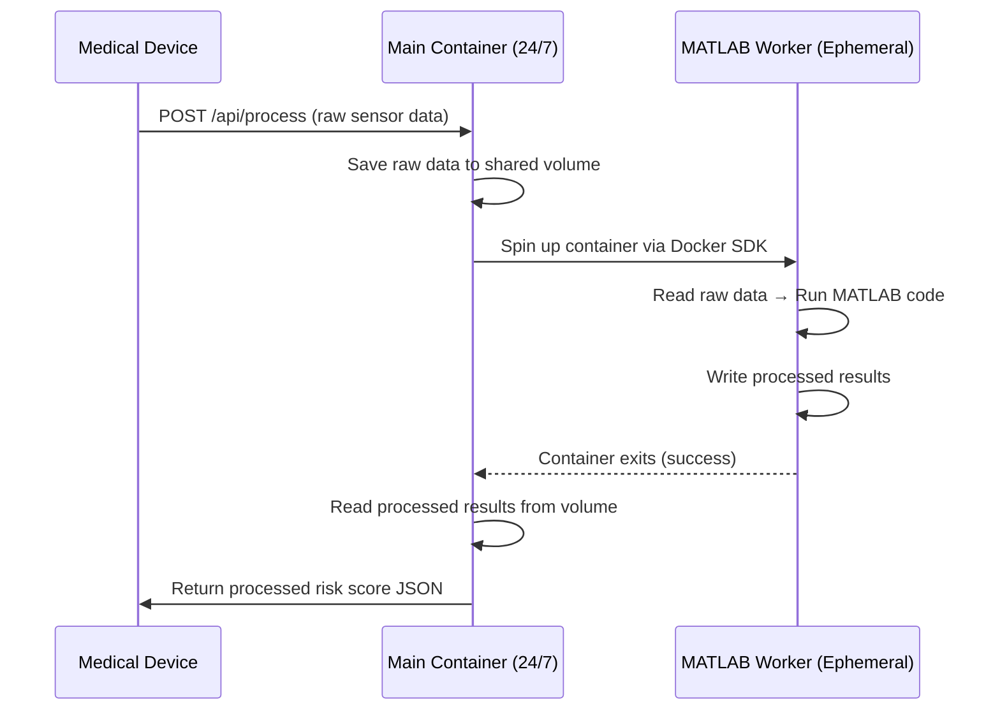

# Docker Compose – Medical Data Processing Pipeline

Build a hub-and-spoke data processing system where a **main orchestrator** receives raw sensor data from medical devices, triggers an **ephemeral MATLAB container** to process it, and returns the results.

## Architecture Overview



## User Review Required

> [!IMPORTANT]
> **MATLAB Runtime Image**: The MATLAB processing container needs MATLAB Compiler Runtime (MCR). You'll need to either:
> 1. Use MathWorks' official Docker image (`mathworks/matlab-runtime`), or
> 2. Build a custom image with your compiled MATLAB executable.
>
> For now, I'll create a **placeholder** that simulates MATLAB processing with a Python script, so you can validate the architecture immediately. You can swap in the real MATLAB code later.

> [!IMPORTANT]
> **Docker-in-Docker**: The main container uses the Docker SDK to spin up the MATLAB worker on demand. This requires mounting the Docker socket (`/var/run/docker.sock`). This is standard for orchestrator patterns but means the main container has access to Docker on the host.

## Proposed Changes

### Project Structure

```
Thamani-TinyML/
├── docker-compose.yml                 # [NEW] Compose orchestration
├── main-orchestrator/                 # [NEW] Main container (always running)
│   ├── Dockerfile
│   ├── requirements.txt
│   ├── app.py                         # Flask API server
│   └── orchestrator.py                # Docker SDK job orchestration
├── matlab-worker/                     # [NEW] Ephemeral MATLAB container
│   ├── Dockerfile
│   ├── requirements.txt
│   └── process.py                     # Placeholder for MATLAB processing
└── shared-data/                       # [NEW] Mounted volume for data exchange
    └── .gitkeep
```

---

### Docker Compose (`docker-compose.yml`)

#### [NEW] [docker-compose.yml](file:///Users/andhan/Desktop/Sami/Thamani/Thamani-TinyML/docker-compose.yml)

- Defines the `main-orchestrator` service (always running, port 5000)
- Defines the `matlab-worker` service with `profiles: ["worker"]` so it **does not** start automatically — it's launched on demand by the orchestrator via Docker SDK
- Creates a shared named volume `shared-data` for data exchange
- Mounts Docker socket into the main container for container management

---

### Main Orchestrator

#### [NEW] [Dockerfile](file:///Users/andhan/Desktop/Sami/Thamani/Thamani-TinyML/main-orchestrator/Dockerfile)
- Python 3.11 slim base image
- Installs Flask + Docker SDK

#### [NEW] [app.py](file:///Users/andhan/Desktop/Sami/Thamani/Thamani-TinyML/main-orchestrator/app.py)
- `POST /api/process` – Accepts raw sensor data (JSON), triggers processing, returns results
- `GET /api/health` – Health check endpoint

#### [NEW] [orchestrator.py](file:///Users/andhan/Desktop/Sami/Thamani/Thamani-TinyML/main-orchestrator/orchestrator.py)
- Uses Docker SDK to spin up the `matlab-worker` container
- Passes a unique job ID via environment variable
- Waits for the worker container to finish
- Reads processed results from the shared volume
- Cleans up the finished container

---

### MATLAB Worker

#### [NEW] [Dockerfile](file:///Users/andhan/Desktop/Sami/Thamani/Thamani-TinyML/matlab-worker/Dockerfile)
- Python 3.11 slim base (placeholder; swap for MCR image later)
- Runs `process.py` on startup

#### [NEW] [process.py](file:///Users/andhan/Desktop/Sami/Thamani/Thamani-TinyML/matlab-worker/process.py)
- Reads raw data from shared volume (by job ID)
- Simulates MATLAB processing (risk score calculation placeholder)
- Writes processed JSON results to shared volume
- Exits when done (container stops)

---

## Data Flow

| Step | Action | Location |
|------|--------|----------|
| 1 | Device sends raw data | `POST /api/process` |
| 2 | Orchestrator saves raw data | `/data/jobs/{job_id}/input.json` |
| 3 | Orchestrator spins up MATLAB worker | Docker SDK → `matlab-worker` container |
| 4 | Worker reads raw data, processes it | `/data/jobs/{job_id}/input.json` → processing |
| 5 | Worker writes results | `/data/jobs/{job_id}/output.json` |
| 6 | Worker exits | Container stops |
| 7 | Orchestrator reads results | `/data/jobs/{job_id}/output.json` |
| 8 | Orchestrator returns results to device | JSON response |

## Verification Plan

### Automated Tests

1. **Validate Docker Compose config**:
   ```bash
   cd /Users/andhan/Desktop/Sami/Thamani/Thamani-TinyML && docker compose config
   ```

2. **Build all images**:
   ```bash
   cd /Users/andhan/Desktop/Sami/Thamani/Thamani-TinyML && docker compose build
   ```

3. **Start the main orchestrator and test the endpoint**:
   ```bash
   # Terminal 1: Start the stack
   docker compose up main-orchestrator

   # Terminal 2: Send test request
   curl -X POST http://localhost:5000/api/process \
     -H "Content-Type: application/json" \
     -d '{"device_id": "DEV-001", "sensor_data": {"heart_rate": 72, "spo2": 98, "temperature": 36.6}}'
   ```
   Expected: JSON response with a processed risk score.

4. **Health check**:
   ```bash
   curl http://localhost:5000/api/health
   ```

### Manual Verification
- Confirm that the MATLAB worker container spins up and then stops after processing (check `docker ps -a`)
- Verify that the `shared-data` volume contains the input/output files for each job
